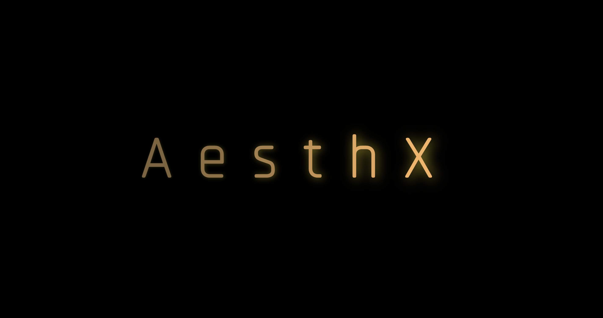
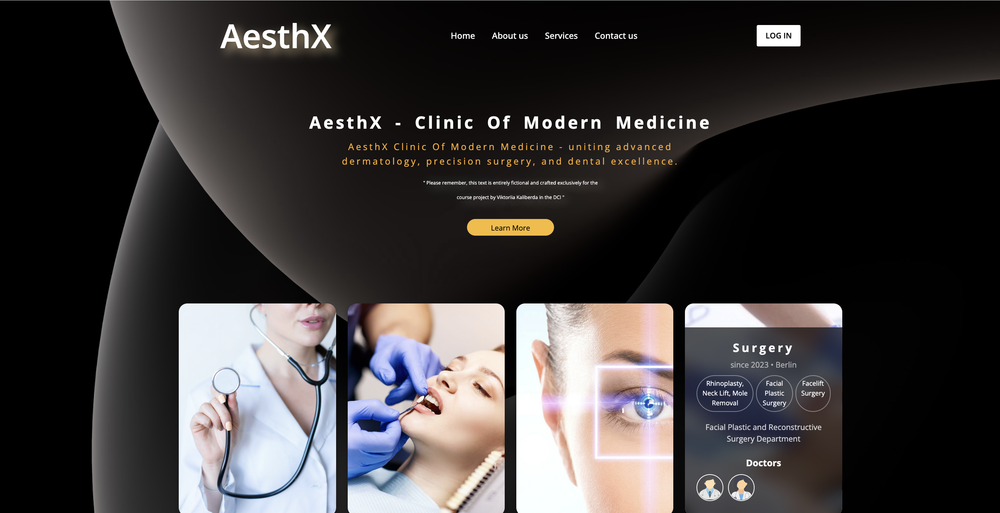

# project-aesthx
https://kaliberda97.github.io/project-aesthx/main

This project is the work of Viktoriia Kaliberda and was created as a test site for the AesthX clinic as part of the DCI study program. :seedling:
The project was created in November 2023. :date:

The project consists of 6 parts and its components.

All descriptions and information about the clinic are completely fictitious and created by AI (artificial intelligence) exclusively for this project. :computer:

:bangbang: The project cannot be copied and is a test-project of Viktoriia Kaliberda.:bangbang:

